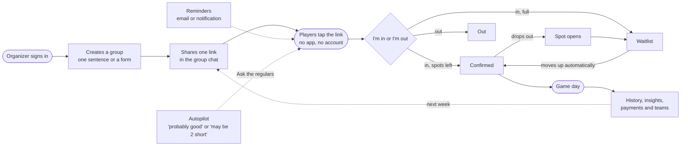
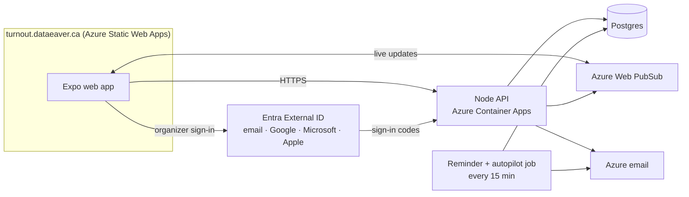

# Turnout

Stop asking who's playing. One link for any recurring game or gathering with limited spots: players tap **I'm in** or **I'm out** (no app, no account), and Turnout handles the count, the waitlist, reminders, dropouts and teams.

- Live: https://turnout.dataeaver.ca · Test: https://turnout-test.dataeaver.ca

## How it works





## Layout

| Path | What |
| --- | --- |
| `apps/mobile` | Expo (React Native) app for iPhone, Android, and web, using Expo Router |
| `apps/api` | Node.js API (Fastify), deployed to Azure Container Apps |
| `packages/shared` | Domain logic and schemas shared by both: roster/waitlist, zod validation |
| `infra` | Bicep + scripts for Azure (see [infra/README.md](infra/README.md)) |
| `.github/workflows` | CI on pull requests; deploy to **test** on push to `main`, to **live** on a `v*` tag |

## Run locally

```bash
npm install
cp apps/api/.env.example apps/api/.env
cp apps/mobile/.env.example apps/mobile/.env
npm run dev:api      # http://localhost:4000 (embedded PGlite, no database server needed)
npm run dev:mobile   # press w for web, i for iOS simulator
```

`npm test` runs every test and `npm run typecheck` checks every package.

## Key design decisions

- **The roster is derived, never stored.** Each RSVP records `status` and `responded_at`. The first `cap` people who said "in" are confirmed and the rest are waitlisted (`packages/shared/src/roster.ts`). Auto-promotion falls out of this, and `promotedMembers()` finds who moved up so we can notify them.
- **Sessions are created on demand.** A group has a schedule (one or more weekdays, every N weeks, start/end dates, time, IANA timezone). The "current" session is the next one that hasn't ended, created the first time someone opens the page. `sessions.starts_at` is the scheduled time; one-off changes (time, place, note, cancelled) are per-week overrides. DST is handled by Luxon.
- **Analytics stay in our database.** Product events go to an `events` table (`apps/api/src/analytics.ts`); no third-party trackers.
- **Members don't need accounts.** Joining returns a random token. The server stores only its SHA-256 hash, and the device keeps the token (SecureStore on native, localStorage on web).
- **Database.** Set `DATABASE_URL` for Postgres (Azure Database for PostgreSQL). Without it, the API runs PGlite in-process. Migrations are append-only SQL in `apps/api/src/db/migrations.ts`.
- **Node runs TypeScript directly** (type stripping), so there is no build step for the API or shared packages. Stick to erasable syntax: no `enum`, `namespace`, or parameter properties.

## Web routes

| Route | Who | What |
| --- | --- | --- |
| `/` | everyone | Landing page (web). The native app opens the dashboard instead. |
| `/g/:slug` | players | The group page: I'm in / I'm out, live roster, cost, reminders, share. Organizer panel when signed in as an owner or co-organizer. |
| `/dashboard`, `/new`, `/edit/:slug`, `/schedule/:slug`, `/members/:slug`, `/teams/:slug`, `/insights/:slug`, `/history/:slug`, `/organizers/:slug` | organizers | Require sign-in (Entra External ID; a dev login locally). |
| `/organize?t=…` | organizers | Accept a co-organizer invite. |
| `/founding` | organizers | "I'd pay for this" (pricing test; nothing is charged). |
| `/admin` | Turnout admins | Product metrics (`ADMIN_EMAILS`). |
| `/email?confirm=…` / `?unsubscribe=…`, `/restore?t=…` | players | Links from emails: reminders, one-tap stop, restore on a new phone. |
| `/stats` | players | Your own stats across the groups on this device (and, signed in, every device). |
| `/privacy`, `/terms` | everyone | Privacy policy and terms. |

## Reminders

Members opt in on the group page, with no account: **browser notifications** (web push via `public/sw.js`; on iPhone only after "Add to Home Screen") and/or **email** (single opt-in with a welcome email and a one-tap stop link, sent through Azure Communication Services). A Container Apps Job runs `apps/api/src/jobs/reminders.ts` every 15 minutes. It sends the evening-before and hours-before reminders (per-group settings) and a one-time nudge to people who haven't answered. `notifications_sent` makes every send happen at most once. Moving up off the waitlist triggers an immediate "You're in!". Organizers can also "Send reminder" now, which notifies subscribed players and gives ready-to-paste text for the group chat. The same job runs autopilot (`apps/api/src/autopilot.ts`): within a day of a game that looks short, it emails the group's organizers once with who to ask.

## Features (v0.3.0 live; newer work on test until the next release)

**Players (no app, no account)**
- Tap I'm in / I'm out; live headcount; cap and a self-running waitlist with "you're in!" when promoted
- Reminders by email or browser notification; "a spot opened up" alerts
- Add to calendar, maps, this week's changes, cost and how to pay, teams
- "That's me" for duplicate names, restore on a new phone, one player across devices
- Your own stats (private): games played, how often you show up, streaks, recent games, unpaid games; on the group page and `/stats`
- Optional sign-in with the same Turnout account organizers use: your games and stats follow you to any phone or the website (organizers who also play see both)

**Organizers**
- Sign in with email code, Google, Microsoft or Apple (branded pages and code email)
- Create in one sentence (AI draft) or by hand: several days, every N weeks, start/end dates, cap, reminder timing, optional cost (per player or split) and payment note
- Share cards for WhatsApp/SMS and rich link previews
- Week by week: skip, move, change the place, add a note, cancel
- Remind now, payment tracking with $ collected, skill ratings and balanced teams, late-dropout flags and emails, members list with merge
- Co-organizers by one-time invite; the owner manages organizers and can hand the group over
- Insights: group health, best times, per-player reliability (factual counts, organizer-only)
- Game history: turnout, dropouts, payments and teams for every past game
- Autopilot: within 48h, "probably good" or "may be N short" with one-tap Ask; heads-up email within 24h if short

**Dashboard and site**
- Expandable group tiles (next game first), live updates, 2-week/month calendar, turnout chart, fill rate, regulars, activity
- Landing page ("Stop asking who's playing"), How it works, Features, Pricing test ($49/year founding price, nothing charged), FAQ, privacy, terms
- One site header and background glow on every web page; hover states everywhere; Turnout icons
- Admin metrics: North Star (games run), answer/reminder/waitlist rates, late drops, spot-alert claims, event counts, pricing answers

## What's left

**Setup in progress**
- [ ] Send email from contact@dataeaver.ca: Azure domain added; waiting on the SPF record update in DNS, then switch the sender
- [ ] Google brand verification: verify dataeaver.ca in Search Console, publish the Google app (Audience), resubmit
- [ ] AI Services account of our own (Azure support ticket for error 715-123420); borrowing ai-receipt's model meanwhile
- [ ] Postgres on private networking before real traffic

**Product, once real groups are using it**
- [ ] Get real groups; watch games run (the North Star)
- [ ] Smart reminder timing from when each group's players usually answer
- [ ] Organizer assistant ("we're short 3, what should I do?")
- [ ] "Who showed up?" after games, to count no-shows
- [ ] Stripe and a real Organizer plan, if the pricing test says yes (every feature is free until then)
- [ ] Store past costs so history doesn't use the current cost setting
- [ ] Native app push notifications (Expo) for players who install the app

**On hold on purpose:** native iOS/Android apps, chat inside Turnout, public player ratings, social profiles, more dashboard charts.

**Maintenance:** the Apple sign-in key (infra/.env.infra) expires every 6 months (next: March 2027). Live keeps one API replica warm (~$15–25/month).
